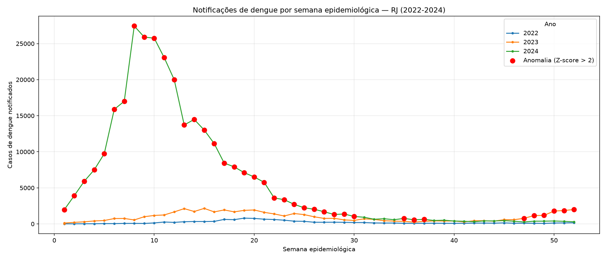

# Detecção de Anomalias em Notificações de Dengue — Rio de Janeiro

Pipeline de dados que consolida notificações de dengue do estado do Rio de Janeiro (SINAN/DataSUS, 2022–2024) para identificar picos anômalos de casos, combinando engenharia de dados, SQL e análise estatística.

**Status:** Em desenvolvimento — pipeline de dados concluído, análise de anomalias em andamento.

## Contexto e motivação

Doenças de notificação compulsória como a dengue dependem de dados lançados manualmente por unidades de saúde no SINAN (Sistema de Informação de Agravos de Notificação). Isso gera problemas reais: subnotificação, lançamentos duplicados e picos anômalos que passam despercebidos até virarem surto — com impacto direto na alocação de leitos, campanhas e equipes de saúde.

Esse projeto nasce da minha experiência como **agente de saúde**, atuando diretamente com dados de vigilância epidemiológica no território. A proposta é aplicar ciência de dados para transformar esse tipo de dado público, hoje subutilizado, em um sinal de alerta acionável para gestores de saúde.

## Principais achados (até o momento)

| Ano | Casos de dengue notificados no RJ |
|---|---|
| 2022 | 11.138 |
| 2023 | 49.917 |
| 2024 | 302.190 |

O salto de mais de **6x** entre 2023 e 2024 é consistente com a emergência em saúde pública declarada no Rio de Janeiro naquele ano — o pipeline já captura, de forma bruta, o próprio fenômeno que o projeto se propõe a detectar de forma sistemática.

## Fonte de dados

- **SINAN / Portal de Dados Abertos do SUS** — dados brutos, caso a caso: https://dadosabertos.saude.gov.br/dataset/arboviroses-dengue
- **InfoDengue (Fiocruz/FGV)** — usado como fonte de validação cruzada das anomalias detectadas: https://info.dengue.mat.br/

##  Arquitetura
notificacoes-anomalias/

├── data/

│ ├── raw/ # dados originais baixados (não versionado)

│ ├── interim/ # dados em limpeza intermediária

│ └── processed/ # dados consolidados prontos para análise

├── notebooks/ # análise exploratória

├── src/

│ ├── ingestion/ # download automatizado dos dados do SINAN

│ ├── cleaning/ # limpeza, tipagem e carga no PostgreSQL

│ ├── analysis/ # detecção de anomalias (em andamento)

│ └── utils/

├── dashboards/

│ └── power_bi/ # dashboard executivo (em andamento)

├── tests/

├── requirements.txt

└── README.md

**Fluxo de dados:** Download (SINAN) → Limpeza e filtro (RJ, 2022–2024) → PostgreSQL → Análise estatística de anomalias → Dashboard executivo.

##  Stack técnica

- **Python** — pandas, SQLAlchemy, requests, python-dotenv
- **PostgreSQL** — armazenamento e consultas analíticas em SQL
- **Power BI** — dashboard executivo (em breve)

##  Desafios técnicos e decisões de engenharia

Este projeto usa dados públicos reais do SINAN/DataSUS — não um dataset já limpo de curso. Abaixo, os principais problemas encontrados e como foram resolvidos.

### 1. Separador de CSV incorreto
**Problema:** leitura inicial com `sep=";"` retornava apenas 1 coluna.
**Solução:** o separador real do arquivo era vírgula (`,`), divergindo do padrão comum em CSVs brasileiros.

### 2. Estouro de memória na leitura do arquivo completo
**Problema:** `ParserError: out of memory` ao carregar o CSV nacional (27 estados).
**Solução:** reescrita da ingestão com `chunksize=50_000`, filtrando o RJ a cada bloco e descartando o resto — o RJ representa apenas 1 de 27 estados no arquivo original.

### 3. Semana epidemiológica excede o tipo SMALLINT no PostgreSQL
**Problema:** carga no banco falhando com `DataError`.
**Investigação:** a coluna `SEM_NOT` segue o formato `AAAASS` (ano + semana, ex: `202237`), não um número de semana isolado — excedendo o limite do tipo `SMALLINT` (32.767).
**Solução:** alteração do tipo da coluna para `INTEGER`.

### 4. Inconsistência aparente entre nome do arquivo e ano dos dados
**Problema:** registros com `NU_ANO = 2023` dentro do arquivo de 2024.
**Investigação:** não é erro — é característica conhecida de sistemas de vigilância epidemiológica, onde um caso de fim de ano pode ser digitado só no início do ano seguinte.
**Decisão:** documentada como limitação conhecida da fonte, sem necessidade de correção.

### 5. Codificação da idade (NU_IDADE)
**Problema:** valores como `4043`, `4048` na coluna de idade, incompatíveis com idade humana real.
**Investigação:** o SINAN codifica idade com um dígito de unidade (1=hora, 2=dia, 3=mês, 4=ano) seguido da quantidade — `4043` = 43 anos.
**Solução:** função de decodificação aplicada na etapa de limpeza, convertendo todos os registros para idade em anos.

## Como rodar

1. Clone o repositório e crie um ambiente virtual:

python -m venv venv

venv\Scripts\activate

pip install -r requirements.txt

2. Crie um banco PostgreSQL e configure o `.env` (veja `.env.example`)
   
3. Rode o pipeline, em ordem:
   
python src/ingestion/download_data.py

python src/cleaning/clean_data.py

python src/cleaning/load_to_postgres.py

### Detecção de anomalias (Z-score, metodologia leave-one-out)

Aplicando Z-score por semana epidemiológica, comparando cada ano contra a 
baseline dos *outros* anos (evitando que o próprio outlier distorça sua 
própria régua de comparação), **39 semanas foram sinalizadas como anomalia** 
(Z-score > 2).

**Achado principal:** quase todas as anomalias detectadas pertencem a 2024 
(Z-scores de até 80), confirmando estatisticamente que 2024 foi um ano 
atípico, não apenas "mais alto" que a média.

**Achado de destaque — alerta precoce:** as semanas epidemiológicas **46 a 52 
de 2023** (novembro/dezembro) já aparecem marcadas como anomalia, com Z-score 
crescente semana a semana (de 5,05 até 18,17). Isso indica que a metodologia 
teria sinalizado a escalada de casos **antes da virada do ano**, quando a 
explosão de 2024 ainda estava em estágio inicial — o tipo de sinal de alerta 
precoce que justifica o valor prático desse tipo de análise para gestores de 
saúde.

**Limitação conhecida:** Z-scores extremamente negativos observados em 2022 
refletem baixa variância na baseline de comparação (apenas 2 anos disponíveis 
para leave-one-out), não anomalias reais de queda. O método é mais confiável 
para detectar picos do que quedas, dado o tamanho da amostra histórica (3 anos).

## 📈 Dashboard executivo (Power BI)

O dashboard consolida os KPIs principais (total de casos, anomalias 
detectadas, variação percentual, alerta mais precoce), a série temporal com 
anomalias destacadas, e um filtro interativo por ano. Construído conectando 
o Power BI diretamente ao PostgreSQL, reaproveitando a mesma query SQL de 
detecção de anomalias (Z-score, leave-one-out) validada anteriormente.

O arquivo `.pbix` está disponível em `dashboards/dashboard_dengue_rj.pbix`.

## Próximos passos

- [ ] Validação das anomalias contra o InfoDengue e notícias de surtos conhecidos
- [ ] Publicação de análise no LinkedIn/Medium com os principais insights

